# Inicialización portátil CRUE

Este documento indica como proceder para la preparación de los portátiles `THOMSON NEO 14.1` adquiridos por la CRUE. 

Básicamente el portátil tendrá la configuración de fábrica, con un usuario genérico con permisos de administrador (podrá instalar cualquier programa) y con la configuración de la wifi ULL-CONECTA.

## Procedimiento de Inicialización

<table>
<tr>
<td>
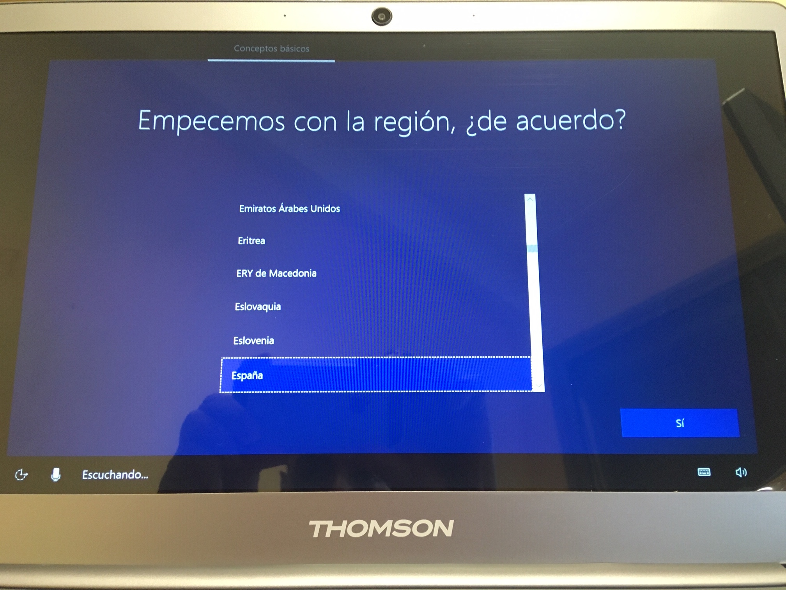
</td>
<td>
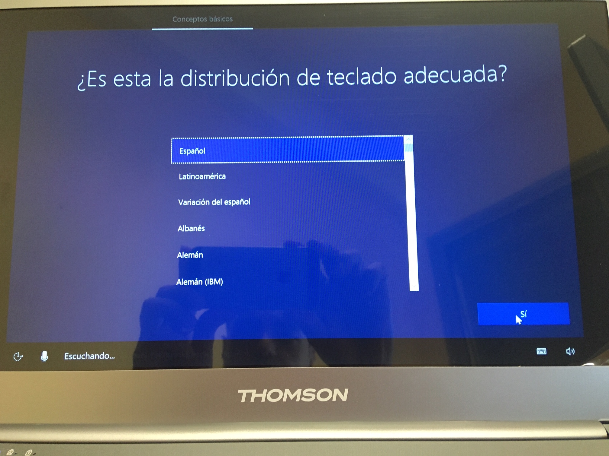
</td>
<td>
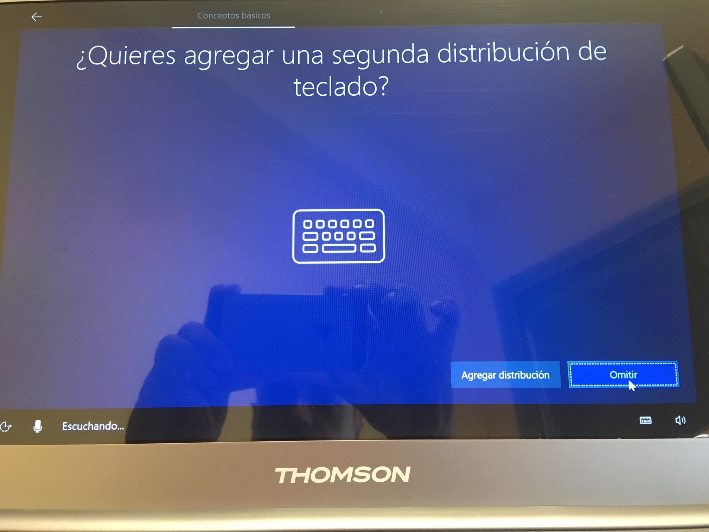
</td>
<td>
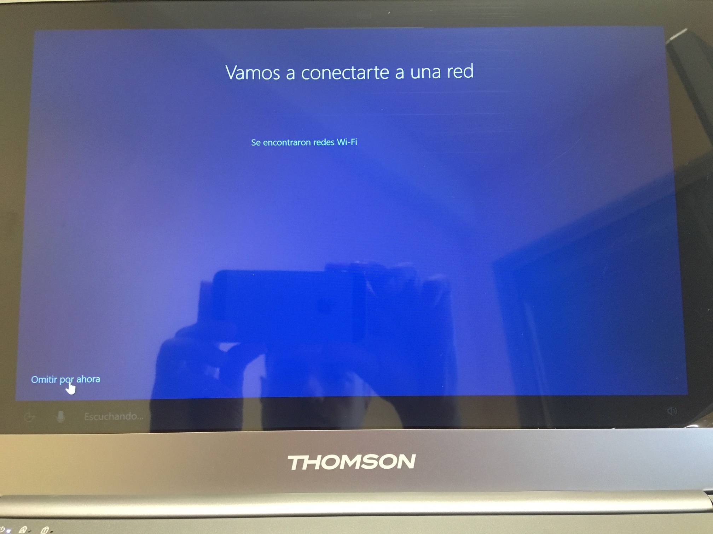
</td>
</tr>
<tr>
<td>
1. Conectar a la alimentación,encender el portátil. Cuando pregunte por la región, seleccionar `España` pulsando `Sí`.
</td>
<td>
2. En la distribución de teclado, seleccionar `Español` pulsando `Sí`.
</td>
<td>
3. Pulsar el botón `Omitir` cuando se pregunte por una segunda distribución de teclado.
</td>
<td>
4. Pulsar en `Omitir por ahora` en la pantalla de conexión a la red.
</td>
</tr>

<tr>
<td>
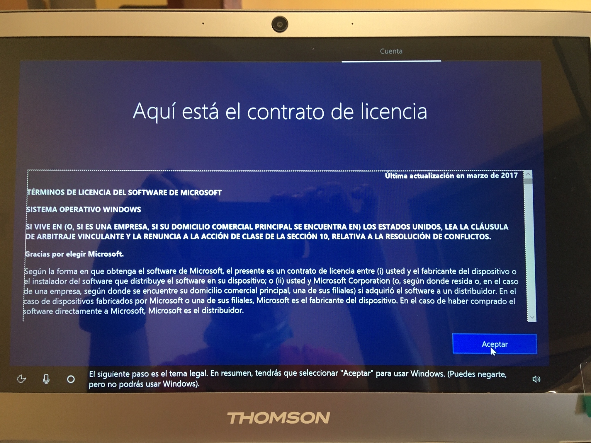
</td>
<td>
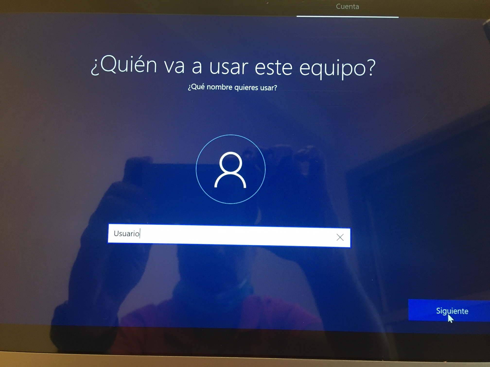
</td>
<td>
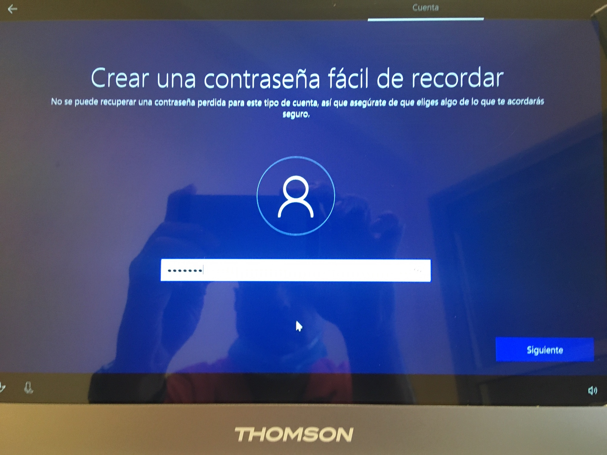
</td>
<td>
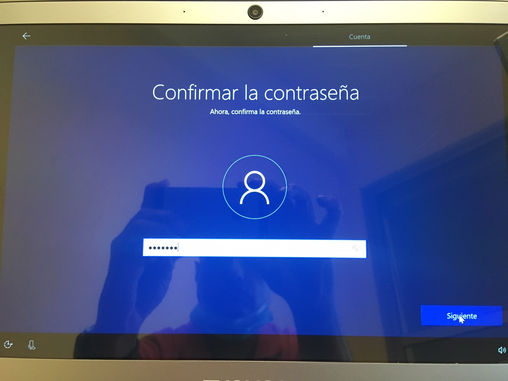
</td>
</tr>
<tr>
<td>
5. Pulsar el botón `Aceptar` en la pantalla del contrato de licencia.
</td>
<td>
6. Escribir `Usuario` cuando se pregunte `Quién va a usar este equipo`.
</td>
<td>
7. Escribir `usuario` cuando se pregunte por la contraseña.
</td>
<td>
8. Escribir de nuevo `usuario` para confirmar la contraseña.
</td>
</tr>

<tr>
<td>
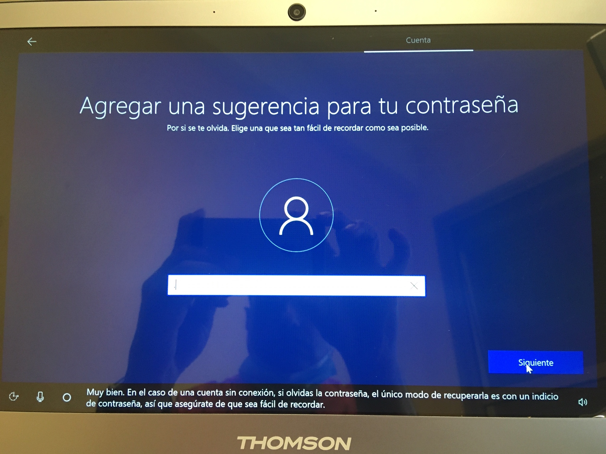
</td>
<td>
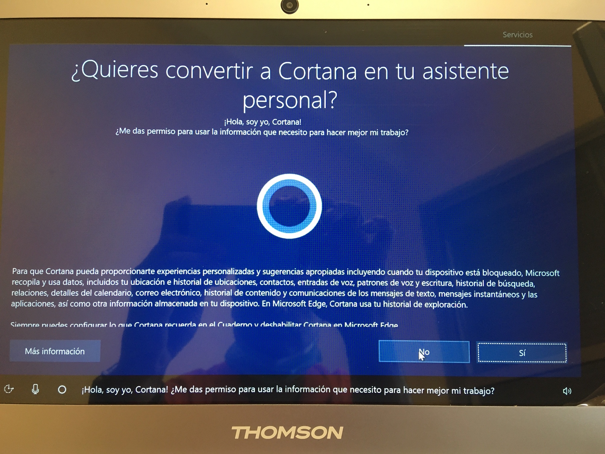
</td>
<td>
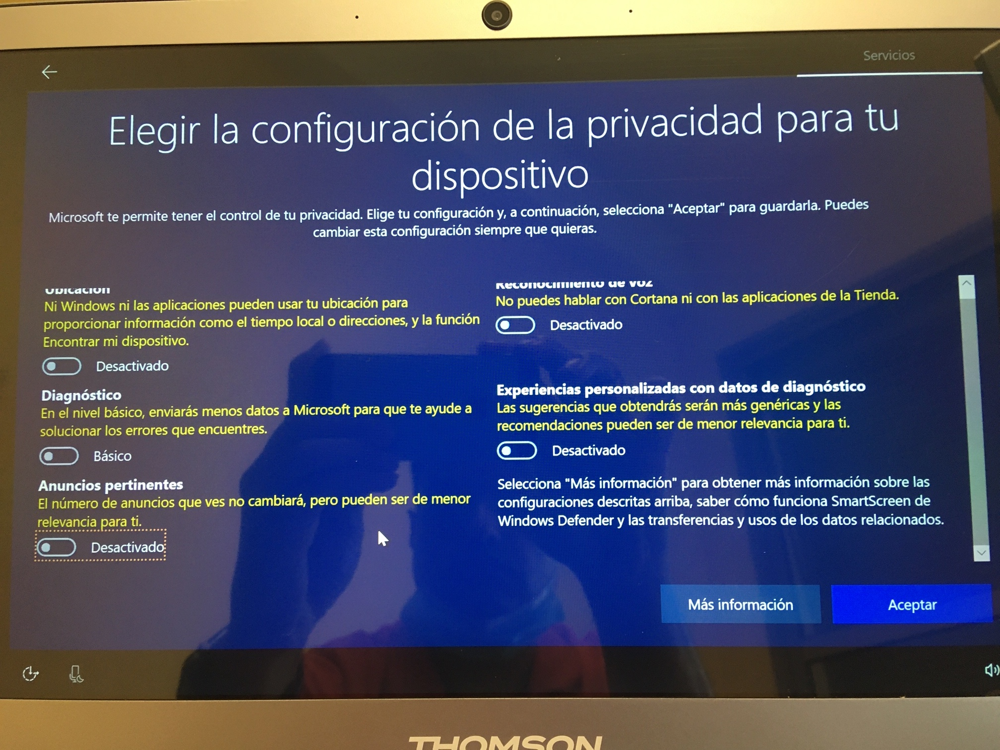
</td>
<td>
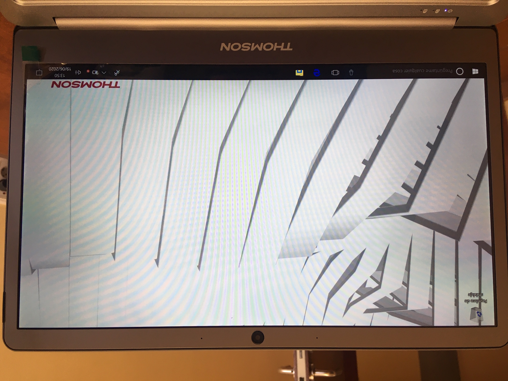
</td>
</tr>
<tr>
<td>
9. Escribir un punto (.) cuando se pregunte por una sugerencia para la contraseña.
</td>
<td>
10. Pulsar `No` cuando se pregunte si se desea a Cortana como asistente.
</td>
<td>
11. Desmarcar todas las opciones en la pantalla de configuración de la privacidad y pulsar `Aceptar`.
</td>
<td>
12. Esperar hasta que se muestre el escritorio de Windows 10.
</td>
</tr>

</table>

## Configuración de la WIFI

Para que se pueda conectar a la wifi `ULL-CONECTA` es necesario ejecutar el siguiente script:

<table>
<tr>
<td>
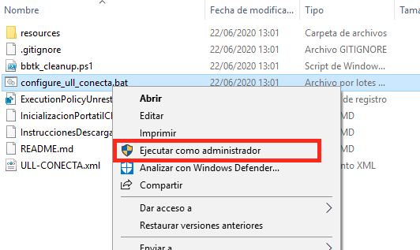
</td>
<td>
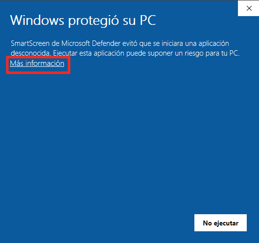
</td>
<td>
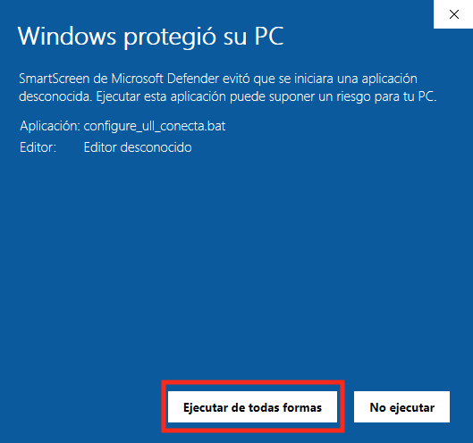
</td>
</tr>
<tr>
<td>
1. Conectar el pendrive y localizar el script `configure_ull_conecta.bat` y ejecutarlo como `Administrador`.
</td>
<td>
2. Si aparece la pantalla `Windows pretegió su PC`, pulsar en el enlace `Más información`.
</td>
<td>
3. Pulsar el botón `Ejecutar de todos modos`.
</td>
</tr>
</table>