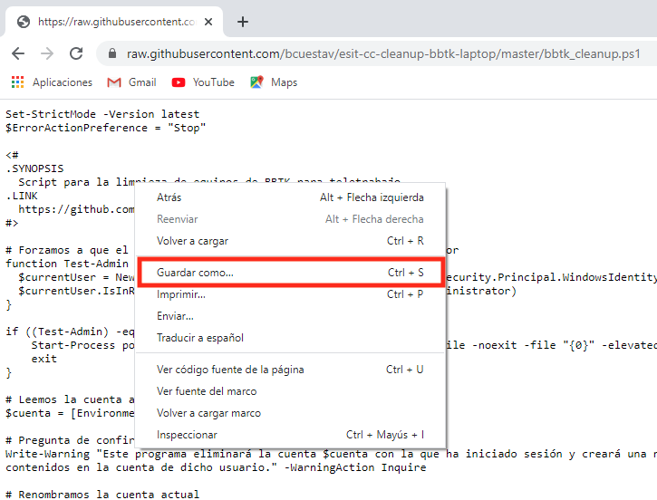
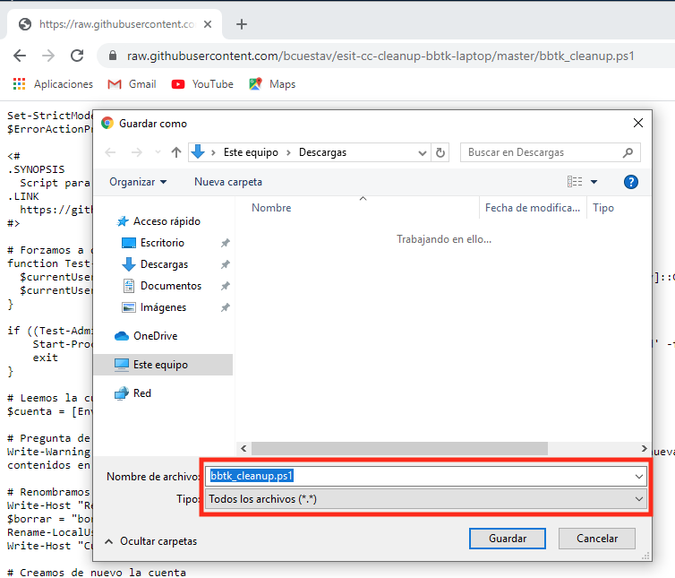

## Descargar el script

Para descargar el script, puede descargarlo directamente de Internet usando este [enlace](https://raw.githubusercontent.com/Universidad-de-La-Laguna/esit-cc-cleanup-bbtk-laptop/master/bbtk_cleanup.ps1) y guardándolo seleccionando `Guardar como...` del menú contextual al pulsar el botón derecho del ratón sobre el código. Asegúrese de que el nombre del fichero termina en `.ps1` y seleccionar `Todos los archivos` en el campo `Tipo`.

    
    

