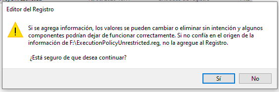
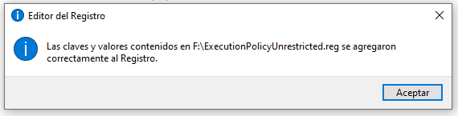
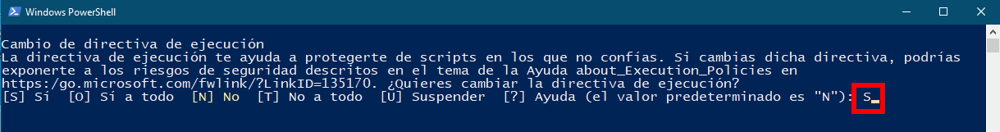

# Script para la limpieza de portátiles de BBTK preparados para teletrabajo.

El script elimina la cuenta con la que se ha iniciado sesión (en los portátiles para teletrabajo es el usuario `Usuario`) y la vuelve a crear. Eso elimina por completo el perfil del usuario y la información personal que tuviera asociada.

Para la ejecución hay que ejecutar dos scripts:

   1. **Activar la directiva de ejecución de scripts**

Localizar el fichero `ExecutionPolicyUnrestricted.reg` y hacer doble clic sobre él para ejecutarlo. Saldrá la siguiente advertencia, en la que hay que pulsar el botón `Sí`. Al finalizar debe salir un mensaje indicando que las claves se añadieron correctamente al Registro.

    
    

> NOTA: Este paso solo hay que hacerlo una vez por ordenador.

   2. **Ejecutar el script**

Una vez tenemos localizado el script `bbtk_cleanup.ps1` en el explorador de archivos, pulsar con el botón derecho del ratón sobre él, y seleccionar `Ejecutar con Powershell`. Saldrá una ventana indicando si se quieren permitir que se hagan cambios en el dispositivo, a la que hay que contestar que `Sí`.

Si se muestra un mensaje con el texto `Cambio de directiva de ejecición`, contestar con una `S`.

A continuación, el script pregunta si se está seguro de continuar, a lo que hay que responder que sí con la letra `S`.

Por último, se cerrará la sesión automáticamente al pasar 5 segundos. Al volver a iniciar sesión de nuevo, se iniciará el proceso de inicialización de la cuenta. Se recomienda usar las siguientes opciones, aunque puede habilitarse cualquiera de las opciones si se considera necesario.

    
    
    
    
    
    
    

