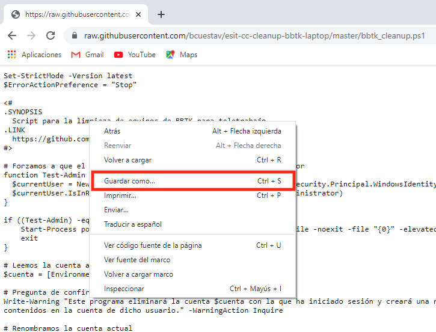
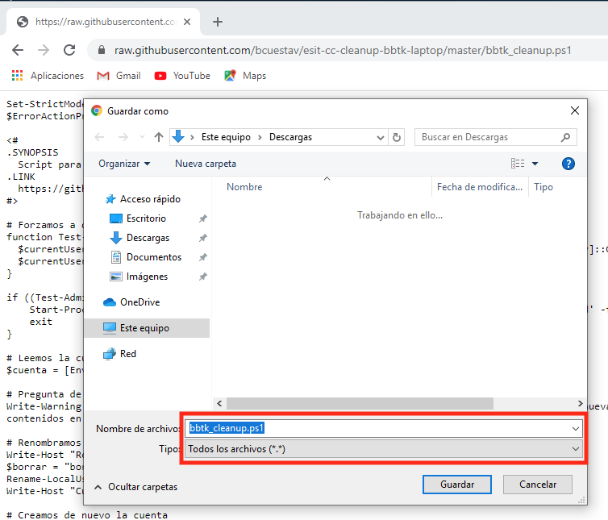

# esit-cc-cleanup-bbtk-laptop

Script para la limpieza de portátiles de BBTK preparados para teletrabajo.

El script elimina la cuenta con la que se ha iniciado sesión (en los portátiles para teletrabajo es el usuario `Usuario`) y la vuelve a crear. Eso elimina por completo el perfil del usuario y la información personal que tuviera asociada.

> IMPORTANTE: Para la ejecución del script es importante activar la directiva de ejecución de scripts. Esto solo hay que hacerlo una vez por equipo. Si ya se ha hecho, ir directamente al apartado [Descargar el script](#Descargar-el-script). De lo contrario, seguir leyendo.

## Activar directiva de ejecución de scripts

Seguir las siguientes instrucciones:

  1. Abrir una consola `Windows Powershell` como administrador.

  Para ello, escribir `powershell` en el cuadro de búsqueda de Windows y seleccionar `Ejecutar como administrador`. Saldrá una ventana indicando si se quieren permitir que se hagan cambios en el dispositivo, a la que hay que contestar que `Sí`.

  2. Habilitar la ejecución de scripts.

  En la nueva ventana que se abrió en el paso anterior, escribir la instrucción `Set-ExecutionPolicy Unrestricted` y pulsar *Enter*. Cuando pregunte si se *quiere cambiar la directiva de ejecución*, responder con una `S` y pulsar *Enter*.

    
    

Una vez hecho, ya se puede cerrar la ventana de la consola Powershell.

## Descargar el script

Para ejecutar el script basta con localizar el fichero `bbtk_cleanup.ps1` usando el explorador de archivos. Si lo tiene en un pendrive, solo tiene que conectarlo. Sino, puede descargarlo directamente de Internet usando este [enlace](https://raw.githubusercontent.com/bcuestav/esit-cc-cleanup-bbtk-laptop/master/bbtk_cleanup.ps1) y guardándolo seleccionando `Guardar como...` del menú contextual al pulsar el botón derecho del ratón sobre el código.

    
    

## Ejecución del script

Una vez tenemos localizado el script en el explorador de archivos, pulsar con el botón derecho del ratón sobre él, y seleccionar `Ejecutar con Powershell`. Saldrá una ventana indicando si se quieren permitir que se hagan cambios en el dispositivo, a la que hay que contestar que `Sí`.

A continuación, el script pregunta si se está seguro de continuar, a lo que hay que responder que sí con la letra `S`.

Por último, se cerrará la sesión automáticamente al pasar 5 segundos. Al volver a iniciar sesión de nuevo, se iniciará el proceso de inicialización de la cuenta. Se recomienda usar las siguientes opciones, aunque puede habilitarse cualquiera de las opciones si se considera necesario.

    
    
    
    
    
    
    

